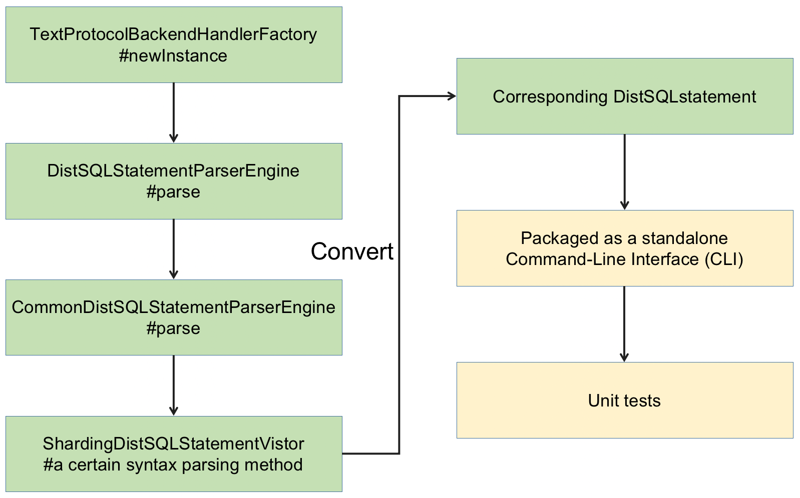
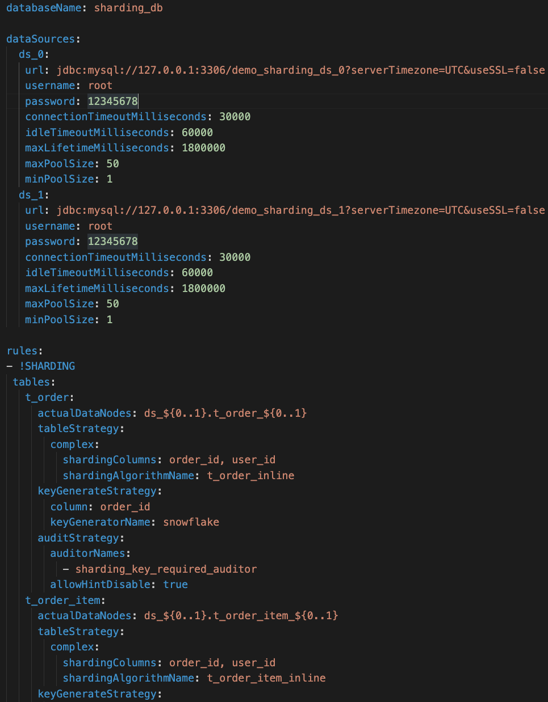
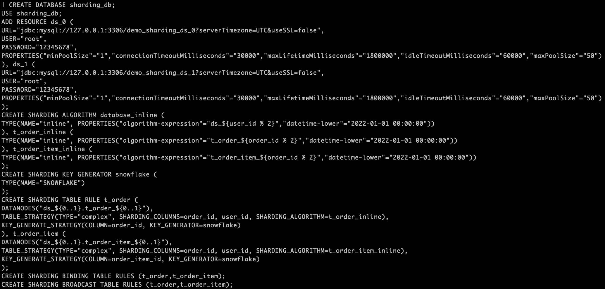

   

# GSoC 2022 - Final Project Report

The following report summarizes my work done during Google Summer of Code 2022 with the **Apache Software Foundation**.

## Contributor Details

- **Name:** Xin Huang (中文: 黄鑫)
- **Github Username:** [isHuangXin](https://github.com/isHuangXin)
- **Mentor:** [Raigor Jiang](https://github.com/RaigorJiang)
- **Organization:** [The Apache Software Foundation](https://www.apache.org)
- **Project Title:** [Develop an external tool to convert YAML configuration into DistSQL scripts](https://summerofcode.withgoogle.com/programs/2022/projects/4PnSweAf)

## About the Project 

    
    
<i>The ecosystem to transform any database into a distributed database system.</i>

 

<a href="https://shardingsphere.apache.org/">Apache ShardingSphere</a> is positioned as a Database Plus, and aims at building a
standard layer and ecosystem above heterogeneous databases. It focuses on how
to reuse existing databases and their respective upper layer, rather than creating
a new database. The goal is to minimize or eliminate the challenges caused by
underlying databases fragmentation.

Since version 5.0.0, shardingSphere provides its own management language: DistSQL, which greatly facilitates users to manage distributed databases. There are
now many users who want to convert from legacy YAML configuration to DistSQL, and we want to design and implement a command line tool that allows the
user to enter a path to a YAML configuration file and output a DistSQL script.

More details:
 

<a href="https://shardingsphere.apache.org/document/current/en/reference/distsql/syntax/rdl/resource-definition/add-resource/">https://shardingsphere.apache.org/document/current/en/reference/distsql/syntax/rdl/resource-definition/add-resource/</a>

## Goals
Develop an external tool to convert YAML configuration into DistSQL scripts. I have built a prototype for this proposal: DistSQL RDL, e.g.ADD and CREATE.It has the function of reading YAML files, parsing the content, and then using DistSQL RDL commands to output DistSQL scripts.

    
    
<i>A pototype of converting Yaml file to DistSQL script.</i>

 

All the DistSQL convert functions and test cases I need to finish.
  
<table align="center">
<tr>
<td><b>ADD RESOURCE DATASOURCE</b></td>
<td><b>TEST CASE</b></td>
</tr>
<tr>
<td><b>CREATE SHARDING TABLE RULE</b></td>
<td><b>TEST CASE</b></td>
</tr>
<tr>
<td><b>CREATE SHARDING BINDING TABLE RULE</b></td>
<td><b>TEST CASE</b></td>
</tr>
<tr>
<td><b>CREATE SHARDING BROADCAST TABLE RULE</b></td>
<td><b>TEST CASE</b></td>
</tr>
<tr>
<td><b>CREATE SHARDING ALGORITHM</b></td>
<td><b>TEST CASE</b></td>
</tr>
<tr>
<td><b>CREATE SHARDING STRATEGY</b></td>
<td><b>TEST CASE</b></td>
</tr>
<tr>
<td><b>CREATE SHARDING KEY GENERATOR</b></td>
<td><b>TEST CASE</b></td>
</tr>
<tr>
<td><b>CREATE READWRITE_SPLITTING RULE</b></td>
<td><b>TEST CASE</b></td>
</tr>
<tr>
<td><b>CREATE DB_DISCOVERY RULE</b></td>
<td><b>TEST CASE</b></td>
</tr>
<tr>
<td><b>CREATE ENCRYPT RULE</b></td>
<td><b>TEST CASE</b></td>
</tr>
<tr>
<td><b>CREATE SHADOW RULE</b></td>
<td><b>TEST CASE</b></td>
</tr>
</table>
 

## Approach and Workflow
- Reading the yaml file, parsing its content and outputing the DistSQL RDL script,
e.g. ADD, Create.
- Wrap DistSQL RDL syntax into a command-line tool ([ConvertYamlConfigurationHandler]()). This allows converting yaml to DistSQL without starting Proxy
- Add new corresponding Yaml files in [Convert folder](https://github.com/apache/shardingsphere/tree/master/shardingsphere-proxy/shardingsphere-proxy-backend/src/test/resources/conf/convert) and expected converted DistSQL in [Expected floder](https://github.com/apache/shardingsphere/tree/master/shardingsphere-proxy/shardingsphere-proxy-backend/src/test/resources/expected).
- Run [ConvertYamlConfigurationHandlerTest](https://github.com/apache/shardingsphere/tree/master/shardingsphere-proxy/shardingsphere-proxy-backend/src/test/java/org/apache/shardingsphere/proxy/backend/handler/distsql/ral/queryable) to make sure there are no exceptions.

    
    
<i>DistSQL Convert Process</i>

 

## Pull Requests and Issues

### Community Bonding period 
Includes Community Issues and PRs.
* ⊙ [#16915](https://github.com/apache/shardingsphere/discussions/16915): Issues: Apply for this project in Discussions

### Coding Period
Includes PRs and Issues related to GSoC project
* ⊙ [#17939](https://github.com/apache/shardingsphere/issues/17939): [ GSoC 2022 ] Develop an external tool to convert YAML configuration into DistSQL scripts
* ✔ [#19280](https://github.com/apache/shardingsphere/pull/19280): Support `ADD RESOURCE DATASOURCE` DistSQL Convert
* ✔ [#19509](https://github.com/apache/shardingsphere/pull/19509): Support `CREATE SHARDING TABLE RULE` DistSQL Convert
* ✔ [#19509](https://github.com/apache/shardingsphere/pull/19509): Support `CREATE SHARDING BINDING TABLE RULE` DistSQL Convert
* ✔ [#20843](https://github.com/apache/shardingsphere/pull/20843): Support `CREATE SHARDING BROADCAST TABLE RULE` DistSQL Convert
* ✔ [#19509](https://github.com/apache/shardingsphere/pull/19509): Support `CREATE SHARDING ALGORITHM` DistSQL Convert
* ✔ [#19509](https://github.com/apache/shardingsphere/pull/19509): Support `CREATE SHARDING STRATEGY` DistSQL Convert
* ✔ [#19509](https://github.com/apache/shardingsphere/pull/19509): Support `CREATE SHARDING KEY GENERATOR` DistSQL Convert
* ✔ [#20648](https://github.com/apache/shardingsphere/pull/20648): Support `CREATE READWRITE_SPLITTING RULE` DistSQL Convert
* ✔ [#20707](https://github.com/apache/shardingsphere/pull/20707): Support `CREATE DB_DISCOVERY RULE` DistSQL Convert
* ✔ [#20748](https://github.com/apache/shardingsphere/pull/20748): Support `CREATE ENCRYPT RULE` DistSQL Convert
* ✔ [#20843](https://github.com/apache/shardingsphere/pull/20843): Support `CREATE SHADOW RULE` DistSQL Convert

## Result
Intended Goals were met during the standard coding period, DistSQL Convert for the Yaml files were achieved.

- Example: the yaml file needs to be converted

    
    
<i>Yaml File</i>

 

- Example: the converted DistSQL script

    
    
<i>Converted DistSQL</i>

 

## Future Scope
Now that the project of Developing an external tool to convert YAML configuration into DistSQL scripts is completed. Next, I will focus on refactoring the [ConvertYamlConfiguration.java](https://github.com/apache/shardingsphere/blob/master/shardingsphere-proxy/shardingsphere-proxy-backend/src/main/java/org/apache/shardingsphere/proxy/backend/handler/distsql/ral/queryable/ConvertYamlConfigurationHandler.java) to achieve [the mixed configuration of DistSQL](https://shardingsphere.apache.org/document/current/cn/user-manual/shardingsphere-jdbc/yaml-config/rules/mix/).

## Acknowledgement
The past 3 months have challenged me to learn and grow. I had a fruitful summer coding and interacting with the Apache ShardingSphere community. This experience made me interested in open source projects, and I will continue contributing solutions and code to the shardingsphere via participating in [WeOpen-Star 2022](https://github.com/weopenprojects/WeOpen-Star/issues/51) (by Tencent).

And finally, I also would like to show my gratitude to my mentor [Raigor Jiang](https://github.com/RaigorJiang) for guiding me throughout this journey and Google for organizing such a beneficial program.

## Additional Links
- [GSoC 2022 Proposal Link](https://summerofcode.withgoogle.com/programs/2022/projects/4PnSweAf1)
- [Github Issues](https://github.com/apache/shardingsphere/issues/17939)
- [Slack Workspace](https://app.slack.com/client/T026JKU2DPF/C026MLH7F34)
  