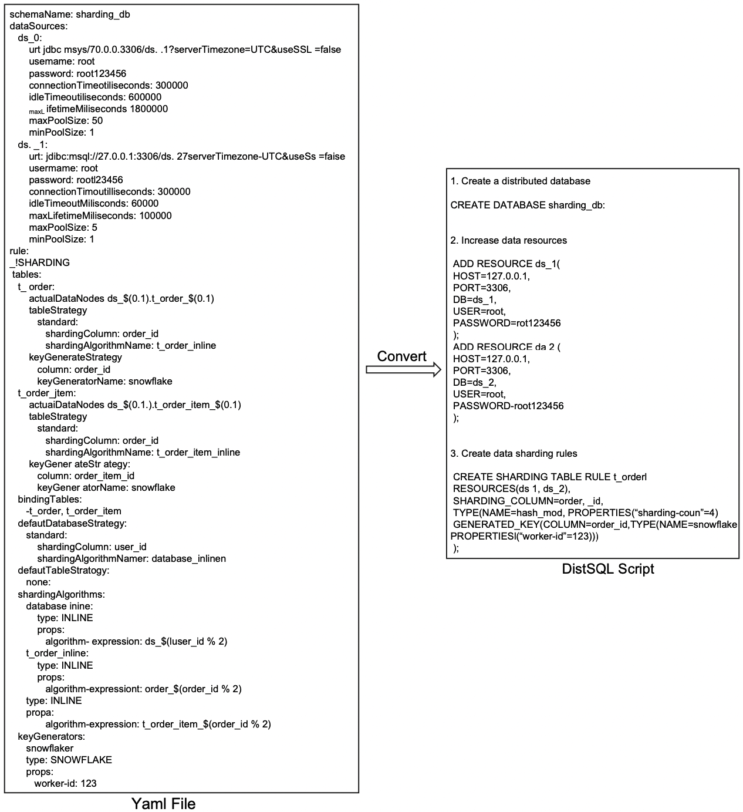

   

# GSoC 2022 - Final Project Report

The following report summarizes my work done during Google Summer of Code 2022 with the **Apache Software Foundation**.

## Contributor Details

- **Name:** Xin Huang (中文: 黄鑫)
- **Github Username:** [isHuangXin](https://github.com/isHuangXin)
- **Mentor:** [Raigor Jiang](https://github.com/RaigorJiang)
- **Organization:** [The Apache Software Foundation](https://www.apache.org)
- **Project Title:** [Develop an external tool to convert YAML configuration into DistSQL scripts](https://summerofcode.withgoogle.com/programs/2022/projects/4PnSweAf)

## About the Project 

    
    
<i>The ecosystem to transform any database into a distributed database system.</i>

 

<a href="https://shardingsphere.apache.org/">Apache ShardingSphere</a> is positioned as a Database Plus, and aims at building a
standard layer and ecosystem above heterogeneous databases. It focuses on how
to reuse existing databases and their respective upper layer, rather than creating
a new database. The goal is to minimize or eliminate the challenges caused by
underlying databases fragmentation.

Since version 5.0.0, shardingSphere provides its own management language: DistSQL, which greatly facilitates users to manage distributed databases. There are
now many users who want to convert from legacy YAML configuration to DistSQL, and we want to design and implement a command line tool that allows the
user to enter a path to a YAML configuration file and output a DistSQL script.

More details:
 

<a href="https://shardingsphere.apache.org/document/current/en/reference/distsql/syntax/rdl/resource-definition/add-resource/">https://shardingsphere.apache.org/document/current/en/reference/distsql/syntax/rdl/resource-definition/add-resource/</a>

## Goals
Develop an external tool to convert YAML configuration into DistSQL scripts. I have built a prototype for this proposal: DistSQL RDL, e.g.ADD and CREATE.It has the function of reading YAML files, parsing the content, and then using DistSQL RDL commands to output DistSQL scripts.

    
    
<i>A pototype of converting Yaml file to DistSQL script.</i>

 

